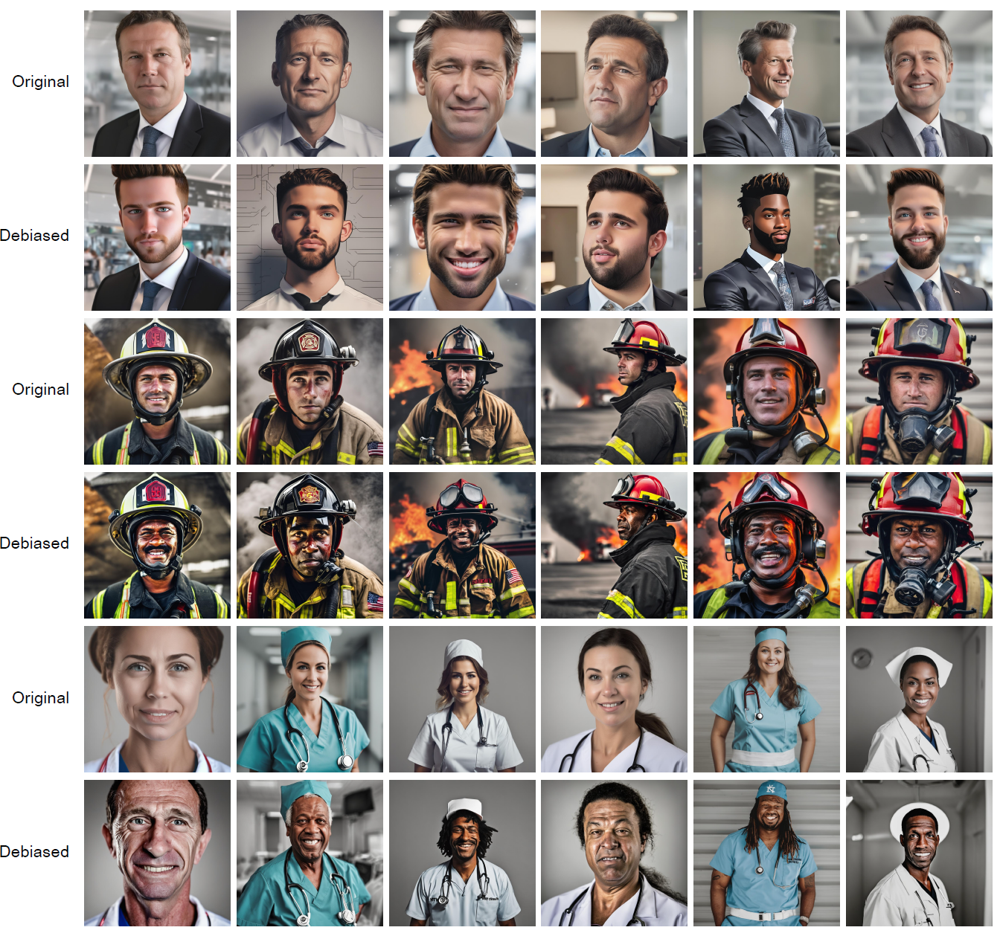
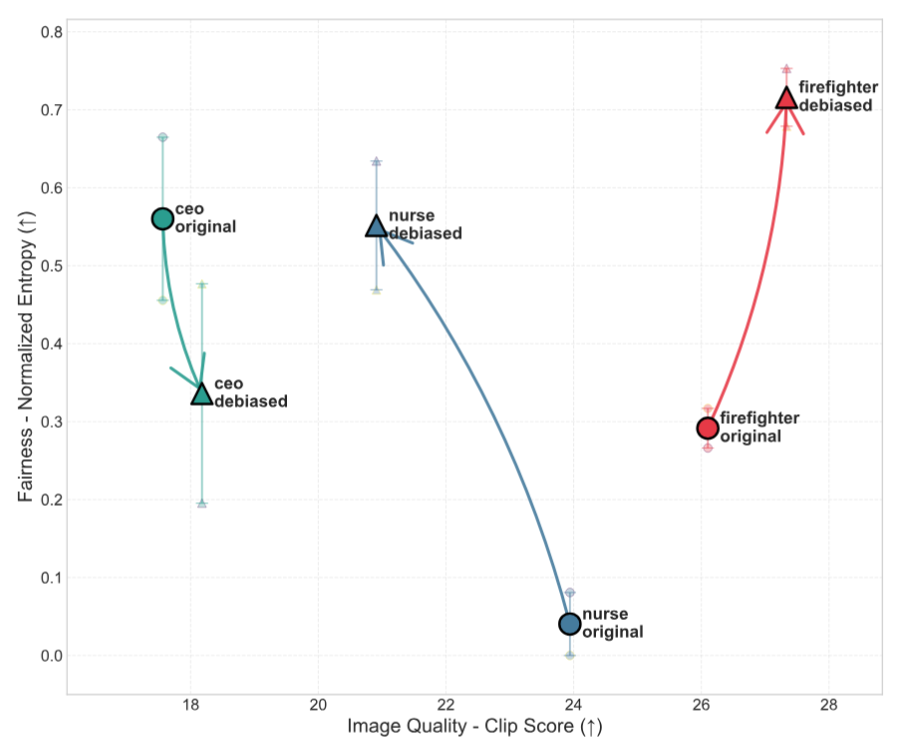

# DeCoDi: Debiasing Classifier-Free Diffusion for Text-to-Image Generation

DeCoDi (Debiasing Classifier-Free Diffusion) is a novel approach for reducing demographic biases in text-to-image generation using Stable Diffusion XL. This implementation provides tools for generating both biased and debiased images for evaluation and comparison.

## Overview

This repository implements the DeCoDi method for debiasing text-to-image generation, which addresses stereotypical associations in diffusion models. The method works by introducing bias concept guidance during the denoising process, helping to generate more diverse and less biased representations.

## Results

### Before and After Comparison

The following image shows a comprehensive comparison between original (biased) and DeCoDi debiased image generations across three professions: CEO, Firefighter, and Nurse. The results demonstrate significant improvement in demographic diversity and reduction of stereotypical associations.

<div align="center">
  
  <br>
  <em>Comparison of original (top rows) vs DeCoDi debiased (bottom rows) generations for CEO, Firefighter, and Nurse professions, showing increased demographic diversity and reduced bias.</em>
</div>

### Fairness vs Quality

Our evaluation demonstrates that DeCoDi achieves an effective balance between fairness (bias reduction) and image quality. The chart below shows the relationship between fairness metrics (normalized entropy) and image quality (CLIP scores) across different professions:

<div align="center">
  
  <br>
  <em>Fairness vs Accuracy trade-off analysis showing DeCoDi's effectiveness in reducing bias while maintaining image quality. Higher entropy values indicate better fairness (more diverse representations), while higher CLIP scores indicate better image quality.</em>
</div>

## Features

- **Multi-profession support**: Generate images for CEO, nurse, and firefighter professions
- **Configurable debiasing**: Enable/disable DeCoDi debiasing with customizable parameters
- **Hyperparameter flexibility**: Choose between default and custom hyperparameter configurations
- **Evaluation tools**: Built-in evaluation pipeline for assessing bias reduction
- **Reproducible results**: Seed-based generation for consistent comparisons

## Requirements

### System Requirements
- Python 3.8+
- CUDA-compatible GPU with at least 12GB VRAM
- 50GB+ free disk space for model downloads

### Dependencies

Install the required packages using the requirements.txt

```bash
pip install -r requirements.txt
```

## Installation

1. Clone the repository:
```bash
git clone https://github.com/your-username/DeCoDi_debiasing.git
cd DeCoDi_debiasing
```

2. Install dependencies:
```bash
pip install -r requirements.txt
```

3. The models will be automatically downloaded on first run to the `sdxl_models/` directory.

## Usage

### Basic Generation

Generate images using the main script:

```bash
cd debiasing_main
python decodi_main.py <mode> <enable_safety_guidance> <default> [output_dir] [cuda_device] [num_images]
```

**Parameters:**
- `mode`: One of `firefighter`, `nurse`, or `ceo`
- `enable_safety_guidance`: `true` to apply DeCoDi debiasing, `false` for standard generation
- `default`: `true` for default settings, `false` for custom high-strength debiasing
- `output_dir` (optional): Custom directory path to save generated images. If not provided, images will be saved to the default `images/` folder
- `cuda_device` (optional): CUDA device (default: cuda:0, e.g., cuda:1, cuda:2)
- `num_images` (optional): Number of images to generate (1-N). If not provided, all seeds from rnd_list.pkl will be used

### Examples

1. Generate debiased CEO images with default parameters:
```bash
python decodi_main.py ceo true true
```

2. Generate standard (non-debiased) nurse images with custom parameters:
```bash
python decodi_main.py nurse false false
```

3. Generate debiased firefighter images with high-strength debiasing:
```bash
python decodi_main.py firefighter true false
```

4. Generate debiased CEO images and save to a custom directory:
```bash
python decodi_main.py ceo true true /path/to/custom/output
```

5. Generate images and save to a relative path:
```bash
python decodi_main.py nurse true false ./my_results
```

6. Generate only 5 debiased CEO images:
```bash
python decodi_main.py ceo true true ./results cuda:0 5
```

7. Generate just 1 image for quick testing:
```bash
python decodi_main.py nurse true false ./test cuda:0 1
```

8. Generate 10 images with default output directory:
```bash
python decodi_main.py firefighter true true "" cuda:0 10
```

9. Generate images on a specific CUDA device:
```bash
python decodi_main.py ceo true true ./results cuda:1
```

10. Generate with custom CUDA device and limited number of images:
```bash
python decodi_main.py nurse true false "" cuda:2 3
```

### Output Structure

Generated images are saved to:
```
images/
├── ethnicityfireighter_safety_guidance_True_default/
├── gendernurse_safety_guidance_False_custom/
└── ageceo_safety_guidance_True_custom/
```

Directory naming pattern: `{concept_type}{mode}_safety_guidance_{enable_safety_guidance}_{config}/`

Each image is named: `{mode}_{type}_{config}_{seed}.jpg`
- `type`: "original" or "debiased"
- `config`: "default" or "custom"  
- `seed`: Random seed for reproducibility

Example files:
- `ceo_debiased_default_42.jpg`
- `firefighter_original_custom_123.jpg`

## Configuration

### Hyperparameters

#### Default Configuration
- **DeCoDi Guidance Scale**: 2000
- **Bias Threshold**: 1.0
- **Warmup Steps**: 7
- **Momentum Scale**: 0.5
- **Momentum Beta**: 0.7
- **CFG Scale**: 7.5

#### Custom Configuration (High-Strength Debiasing)
- **DeCoDi Guidance Scale**: 15000
- **Bias Threshold**: 0.025
- **Warmup Steps**: 7
- **Momentum Scale**: 0.5
- **Momentum Beta**: 0.7
- **CFG Scale**: 12

### Bias Concepts

The system uses predefined bias concept descriptions for each profession:

- **CEO**: Age-related stereotypes (elderly, senior, gray hair, balding, receding hairline, aging, aged, mature face, crow's feet, sagging skin, white hair, glasses, stooped posture, frail, age spots, middle-aged, older man, older woman, senior executive, aging leader, late 50s, 60s, 70s, aged features)
- **Nurse**: Gender-related stereotypes (woman, female, feminine, soft features, delicate, long hair, ponytail, makeup, slender build, gentle expression, nurturing demeanor, soft smile, maternal, traditional femininity, skirt, dress, apron, feminine posture, small hands, petite frame, caring woman, young female, lady nurse, lipstick, subtle makeup, earrings, jewelry)
- **Firefighter**: Ethnicity-related stereotypes (Caucasian, white, pale skin, Eurocentric, blonde, light eyes, light hair, fair complexion, European features, narrow nose, straight hair, light-skinned, Western traits, Nordic, Anglo-Saxon, European ethnicity)

## Evaluation

### Jupyter Notebook Evaluation

1. Navigate to the evaluation directory:
```bash
cd evaluation
```

2. Launch Jupyter Notebook:
```bash
jupyter notebook evaluation.ipynb
```

3. Run the evaluation cells to analyze bias metrics and generate visualizations.

### Fairness vs Accuracy Chart Generation


To recreate the results chart showing Fairness - Normalized Entropy (↑) vs Image Quality - Clip Score (↑) analysis, use the evaluation script:

```bash
cd evaluation/image_quality
python decodi_chart_eval.py \
  --input_csv marco_lucas_test_data.csv \
  --clip_scores_file average_clip_scores.json \
  --output_dir {output_directory}
```

**Parameters:**
- `input_csv`: CSV file containing the evaluation annotations
- `clip_scores_file`: JSON file with pre-calculated CLIP scores for image quality assessment
- `output_dir`: Directory where the fairness vs accuracy charts will be saved

This script will generate:
- Individual evaluator charts showing fairness vs accuracy trade-offs
- Combined chart showing average results across all evaluators
- Detailed JSON files with evaluation metrics

### UI Labeling Tool

For manual evaluation and labeling:

1. Navigate to the UI directory:
```bash
cd UI_label_images
```

2. Start the Flask application:
```bash
python UI_app.py
```

3. Open your browser to `http://localhost:5000` to begin labeling images.

## Project Structure

```
DeCoDi_debiasing/
├── debiasing_main/
│   ├── decodi_main.py                          # Main generation script
│   ├── decodi_class_free_guidance.py           # Core DeCoDi implementation
│   ├── decodi_pipeline_base_breakdown.py       # Base pipeline utilities
│   ├── decodi_pipeline_refiner_breakdown.py    # Refiner pipeline utilities
│   └── rnd_list.pkl                           # Random seeds for reproduction
├── evaluation/
│   ├── evaluation.ipynb                       # Evaluation notebook
│   ├── export_results/                        # Generated evaluation results
│   ├── image_quality/
│   │   ├── decodi_chart_eval.py              # Chart generation script
│   │   ├── marco_lucas_test_data.csv         # Evaluation data
│   │   └── average_clip_scores.json          # CLIP scores
│   └── *.xlsx                                # GPT evaluation results
├── UI_label_images/
│   ├── UI_app.py                             # Manual labeling interface
│   ├── templates/                            # HTML templates
│   └── labeled_images/                       # User-labeled data
├── pickle files/                             # Metadata and seed files
├── sdxl_models/                              # Downloaded SDXL models
├── images/                                   # Generated images (created on first run)
├── requirements.txt                          # Python dependencies
├── results.png                               # Sample results comparison
├── result_chart_eval.png                     # Fairness vs accuracy chart
└── README.md                                 # This file
```

## Technical Details

### DeCoDi Algorithm

The DeCoDi method implements bias correction through the following key steps:

1. **Bias Concept Encoding**: Encodes textual descriptions of stereotypical attributes
2. **Three-Way Guidance**: Uses unconditional, conditional, and bias concept predictions
3. **Adaptive Correction**: Applies bias correction based on detected stereotype strength
4. **Momentum-Based Smoothing**: Uses momentum to stabilize the debiasing process

### Key Equations

- **Bias Detection**: `scale = clamp(|noise_pred_text - noise_pred_bias| * guidance_scale, max=1.0)`
- **Threshold Application**: Applied when `(noise_pred_text - noise_pred_bias) >= threshold`
- **Debiasing Guidance**: `guidance = (noise_pred_bias - noise_pred_uncond) * scale + momentum`
- **Final Correction**: `noise_pred = noise_pred_uncond + cfg_scale * (base_guidance - debiasing_guidance)`